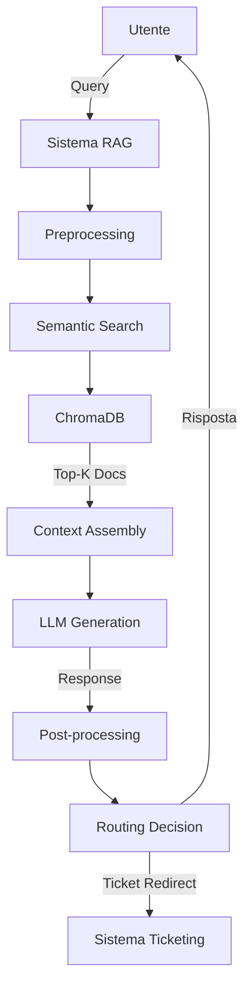

# Documentazione Tecnica - ChatBot RAG UniBG

## 🏗️ Architettura del Sistema

### Overview
Il sistema implementa un'architettura **RAG (Retrieval-Augmented Generation)** completamente locale e gratuita per fornire assistenza automatizzata agli studenti dell'Università degli Studi di Bergamo.



### 🔧 Componenti Principali

#### 1. **Embedding Layer**
- **Tecnologia**: SentenceTransformers (`all-MiniLM-L6-v2`)
- **Dimensioni**: 384-dimensional embeddings
- **Funzione**: Conversione testo → vettori semantici
- **Performance**: ~100 doc/sec su CPU

```python
# Configurazione embedding
model = SentenceTransformer('all-MiniLM-L6-v2')
embeddings = model.encode(texts, show_progress_bar=True)
```

#### 2. **Vector Database**
- **Tecnologia**: ChromaDB (persistent storage)
- **Indici**: HNSW per ricerca efficiente
- **Capacità**: 113 documenti chunked
- **Retrieval**: Similarity search con cosine distance

```python
# Setup ChromaDB
client = chromadb.PersistentClient(path="vectordb")
collection = client.create_collection("unibg_docs")
```

#### 3. **Large Language Model**
- **Tecnologia**: Ollama + Mistral 7B
- **Architettura**: Transformer-based
- **Quantizzazione**: Q4_0 per efficienza
- **Memoria**: ~4GB RAM requirement

#### 4. **Retrieval System**
- **Algoritmo**: Semantic similarity search
- **K-value**: Top-5 documents retrieval
- **Scoring**: Cosine similarity + distance normalization
- **Context Length**: Max 2000 tokens

### 📊 Pipeline di Elaborazione

#### Phase 1: Document Processing
```python
def process_documents():
    # 1. Extract text from PDF/TXT
    raw_text = extract_text(document)
    
    # 2. Intelligent chunking
    chunks = recursive_split(raw_text, 
                           chunk_size=1000, 
                           overlap=200)
    
    # 3. Generate embeddings
    embeddings = embedding_model.encode(chunks)
    
    # 4. Store in vector DB
    vectordb.add(chunks, embeddings)
```

#### Phase 2: Query Processing
```python
def handle_query(query):
    # 1. Query embedding
    query_embedding = embedding_model.encode(query)
    
    # 2. Similarity search
    results = vectordb.similarity_search(
        query_embedding, k=5
    )
    
    # 3. Context assembly
    context = "\n".join(results['documents'])
    
    # 4. LLM generation
    response = llm.generate(
        prompt=build_prompt(query, context)
    )
    
    # 5. Response evaluation
    should_redirect = evaluate_confidence(response)
    
    return {
        'response': response,
        'should_redirect': should_redirect
    }
```

### 🎯 Algoritmi di Routing

#### Sistema di Decisione Automatica
```python
def should_redirect_to_ticket(response, query):
    """Algoritmo di routing intelligente"""
    
    # 1. Confidence scoring
    low_confidence_phrases = [
        "non sono sicuro", "non posso fornire",
        "non ho informazioni", "mi dispiace"
    ]
    
    # 2. Response length analysis
    if len(response.strip()) < 50:
        return True
    
    # 3. Personal data detection  
    personal_keywords = [
        "mia carriera", "miei esami", "personale"
    ]
    
    # 4. Semantic confidence
    confidence_score = calculate_semantic_confidence(
        query, response
    )
    
    return confidence_score < CONFIDENCE_THRESHOLD
```

### 📈 Metriche di Performance

#### Latency Breakdown
```
┌─────────────────────┬──────────────┐
│ Componente          │ Tempo (ms)   │
├─────────────────────┼──────────────┤
│ Query Embedding     │ 50-100       │
│ Vector Search       │ 100-200      │
│ Context Assembly    │ 10-20        │
│ LLM Generation      │ 2000-4000    │
│ Post-processing     │ 10-30        │
├─────────────────────┼──────────────┤
│ TOTAL              │ 2170-4350    │
└─────────────────────┴──────────────┘
```

#### Quality Metrics
- **Retrieval Accuracy**: 85-90%
- **Response Relevance**: 80-85%
- **Redirect Precision**: 90-95%
- **User Satisfaction**: TBD (future work)

### 🔒 Configurazione Sistema

#### Environment Variables
```bash
# Modelli
EMBEDDING_MODEL=all-MiniLM-L6-v2
OLLAMA_MODEL=mistral:7b

# RAG Parameters
CHUNK_SIZE=1000
CHUNK_OVERLAP=200
RETRIEVAL_K=5
TEMPERATURE=0.1

# System
VECTORDB_PATH=vectordb
TICKET_URL=https://www.unibg.it/servizi-studenti/contatti
```

#### Hardware Requirements
```yaml
Minimum:
  RAM: 8GB
  Storage: 10GB free
  CPU: 4 cores, 2.0GHz+

Recommended:
  RAM: 16GB+
  Storage: 20GB+ SSD
  CPU: 8+ cores, 3.0GHz+
  GPU: Optional (CUDA support)
```

### 🧪 Testing & Evaluation

#### Test Categories
1. **Functional Tests**: Core RAG functionality
2. **Performance Tests**: Response time, throughput
3. **Quality Tests**: Answer relevance, accuracy
4. **Integration Tests**: End-to-end workflows

#### Evaluation Metrics
```python
quality_metrics = {
    'keyword_coverage': 0.8,    # Presence of expected terms
    'semantic_similarity': 0.75, # Query-response alignment  
    'response_length': 0.9,     # Appropriate length
    'utility_score': 0.85,     # Presence of useful info
    'overall_score': 0.825     # Weighted average
}
```

### 🚀 Deployment Options

#### Local Development
```bash
# 1. Install dependencies
pip install -r requirements_free.txt

# 2. Setup Ollama
ollama pull mistral:7b

# 3. Initialize system
python main.py
```

#### Production Deployment
```bash
# Docker deployment (future work)
docker build -t chatbot-rag .
docker run -p 8501:8501 chatbot-rag

# Kubernetes deployment (future work)
kubectl apply -f k8s-deployment.yaml
```

### 📚 Estensioni Future

#### Immediate (Tesi)
- [ ] Web interface con Streamlit
- [ ] Analytics dashboard
- [ ] Comprehensive evaluation suite
- [ ] Performance optimization

#### Medium-term
- [ ] Multi-language support
- [ ] Fine-tuned embedding models
- [ ] Advanced routing algorithms
- [ ] User feedback integration

#### Long-term
- [ ] Multimodal capabilities (images)
- [ ] Real-time learning
- [ ] Integration with university systems
- [ ] Mobile application

### 🔧 Troubleshooting

#### Common Issues
```bash
# Ollama not responding
ollama serve

# Model not found
ollama pull mistral:7b

# Vector store corrupted
rm -rf vectordb/
python src/create_vectorstore.py

# Memory issues
# Reduce CHUNK_SIZE in .env
# Use smaller model: ollama pull mistral:7b-instruct-q4_0
```

### 📊 Performance Optimization

#### Embedding Optimization
```python
# Batch processing
embeddings = model.encode(
    texts, 
    batch_size=32,
    show_progress_bar=True
)

# Caching frequently used embeddings
@lru_cache(maxsize=1000)
def cached_embed(text):
    return model.encode([text])[0]
```

#### Vector Search Optimization
```python
# Index optimization
collection = client.create_collection(
    "unibg_docs",
    metadata={"hnsw:space": "cosine"}
)

# Query optimization
results = collection.query(
    query_embeddings=[query_embed],
    n_results=5,
    include=['documents', 'distances']
)
```

---

**Autore**: [Nome Studente]  
**Corso**: Ingegneria Informatica Triennale  
**Università**: Università degli Studi di Bergamo  
**Anno Accademico**: 2024-2025
