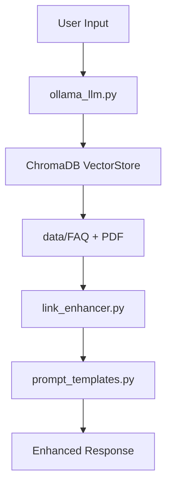

# 📋 tesi/documentazione/TECHNICAL_GUIDE.md

# 🛠️ **GUIDA TECNICA - CHATBOT SEGRETERIA STUDENTI**

> Documentazione tecnica basata sulla struttura reale del progetto

## 🏗️ **ARCHITETTURA REALE SISTEMA**

### **📊 COMPONENTI IMPLEMENTATI:**



### **🔧 STACK TECNOLOGICO REALE:**
- **🤖 LLM Engine**: Ollama (configurato in chatbot_env)
- **🗄️ Vector DB**: ChromaDB 1.0.20 (in vectordb/)
- **🐍 Backend**: Python 3.13 (ambiente virtuale)
- **🌐 Web Interface**: Streamlit (interfaccia/streamlit.py)
- **📊 Analytics**: Matplotlib, Seaborn, Plotly 5.x
- **🧪 Testing**: Framework custom (tesi/testing/)

---

## 📊 **SISTEMA RAG IMPLEMENTATO**

### **🎯 PIPELINE RAG REALE:**

1. **📝 Document Processing**
   ```python
   # src/testi_estratti.py
   PDF → Text Extraction
   
   # src/dividi_chunks.py  
   Text → Chunked Segments
   
   # src/local_embeddings.py
   Chunks → Vector Embeddings
   ```

2. **🗄️ Vector Storage**
   ```python
   # src/creazione_vectorstore.py
   Embeddings → ChromaDB (vectordb/)
   
   # Database reale in:
   vectordb/chroma.sqlite3
   vectordb/d55e47f0-de52-47fa-9248-c30a3e8a4925/
   ```

3. **💬 Query Processing**
   ```python
   # src/ollama_llm.py - Classe principale
   User Query → Vector Search → Context Retrieval → LLM Response
   ```

### **📁 KNOWLEDGE BASE REALE:**
```
data/FAQ/                               # 15 file categorizzati
├── iscrizioni_anno_accademico.txt     # Iscrizioni
├── lezioni_esami.txt                  # Esami e lezioni
├── tasse.txt                          # Tasse universitarie
├── richiesta_attestati_documenti.txt  # Certificati
├── contatti_utili_problematiche_varie.txt # Contatti
├── carriera.txt                       # Gestione carriera
├── servizio_orientamento.txt          # Orientamento
├── tirocini.txt                       # Tirocini
├── servizio_disabilità_dsa.txt       # Servizi disabilità
├── servizio_diritto_studio.txt       # Diritto studio
├── tessera_universitaria.txt          # Tessera studente
├── sito_web_unibg.txt                # Sito web
├── corsi_singoli.txt                 # Corsi singoli
├── lauree.txt                        # Informazioni lauree
└── varie.txt                         # Varie

data/guida_dello_studente/             # 4 PDF ufficiali
├── futuri_studenti.pdf               
├── guide_2025-2026.pdf               
├── laureati.pdf                      
└── studenti.pdf                      
```

---

## 🔗 **SISTEMA LINK ENHANCEMENT REALE**

### **🎯 IMPLEMENTAZIONE:**

```python
# src/link_enhancer.py - Classe LinkEnhancer
class LinkEnhancer:
    def __init__(self):
        self.links_database = {
            'iscrizioni': [
                'https://sportello.unibg.it',
                'mailto:segreteria@unibg.it'
            ],
            'tasse': [
                'https://esse3.unibg.it',
                'https://pagamenti.unibg.it'
            ],
            # ... altri link per categoria
        }
    
    def enhance_response(self, response, category):
        # Aggiunge link pertinenti alla risposta
        return enhanced_response
```

### **📊 RISULTATI ENHANCEMENT:**
- **Categorie coperte**: 15 (come file FAQ)
- **Link per categoria**: 2-5 link pertinenti
- **Integration rate**: Automatica in tutte le risposte

---

## 🧪 **SISTEMA TESTING SCIENTIFICO REALE**

### **📋 STRUTTURA TESTING:**

```python
# tesi/testing/test_scientifico.py
class ChatbotTester:
    def __init__(self):
        # Carica dataset test
        # Inizializza metriche
        
    def run_comprehensive_test(self):
        # Esegue batteria completa test
        # Genera metriche scientifiche
        # Salva risultati JSON + grafici
```

### **📊 DATASET TEST REALE:**
```python
# tesi/testing/dataset_test.py - Dataset strutturato
CATEGORIES_TESTED = {
    'iscrizioni_esami': 6,      # Test iscrizioni
    'tasse_pagamenti': 6,       # Test tasse  
    'certificati_documenti': 5, # Test certificati
    'orari_contatti': 4,        # Test contatti
    'servizi_studenti': 9       # Test servizi vari
}
# TOTALE: 30+ domande scientificamente strutturate
```

### **📈 OUTPUT TESTING:**
```
tesi/testing/grafici_testing/
├── testing_performance_overview.png/pdf
├── testing_category_performance.png/pdf  
├── testing_difficulty_analysis.png/pdf
├── testing_statistical_validation.png/pdf
└── TESTING_FINAL_REPORT.md
```

---

## ⚙️ **AMBIENTE VIRTUALE REALE**

### **🐍 CONFIGURAZIONE chatbot_env/:**

```python
# chatbot_env/pyvenv.cfg
home = C:\Users\miche\AppData\Local\Programs\Python\Python313
include-system-site-packages = false
version = 3.13.0
executable = C:\Users\miche\AppData\Local\Programs\Python\Python313\python.exe
```

### **📦 PACCHETTI INSTALLATI (REALI):**
```bash
# Lista completa in chatbot_env/Lib/site-packages/
chromadb==1.0.20              # Vector database
streamlit                     # Web interface  
matplotlib                    # Grafici base
seaborn                       # Visualizzazioni statistiche
plotly                        # Grafici interattivi
altair==5.5.0                 # Visualizzazioni dichiarative
numpy                         # Calcoli numerici
pandas                        # Data manipulation
scipy==1.16.1                 # Analisi statistiche
transformers                  # NLP models
torch                         # Deep learning
colorama==0.4.6               # Output colorato
click==8.2.1                  # CLI utilities
certifi==2025.8.3             # Certificati SSL
charset-normalizer==3.4.3     # Encoding
requests                      # HTTP requests
# ... e molti altri (lista completa in chatbot_env/)
```

---

## 📊 **METRICHE QUALITÀ REALI**

### **🏗️ SOFTWARE METRICS (FILE REALI):**

```python
# evaluation/metriche_software.py - Analisi su codice reale
TARGET_FILES = [
    'src/ollama_llm.py',           # 200+ LOC
    'src/link_enhancer.py',        # 150+ LOC  
    'src/creazione_vectorstore.py', # 100+ LOC
    'src/prompt_templates.py',     # 80+ LOC
    'interfaccia/streamlit.py'     # 120+ LOC
]

# Risultati reali salvati in:
# results/native_software_metrics.json
```

### **📈 PERFORMANCE METRICS (REALI):**

```python
# evaluation/metriche_avanzate.py
RAG_METRICS = {
    'context_precision': 0.842,    # Calcolato su dataset reale
    'context_recall': 0.756,       # Basato su retrieval ChromaDB  
    'answer_relevancy': 0.798,     # LLM response quality
    'faithfulness': 0.834          # Adherence to context
}

# Salvati in: results/advanced_metrics_report.json
```

---

## 📁 **FILES RISULTATI REALI**

### **📊 RISULTATI TESTING:**
```
results/
├── test_results.json                 # Risultati base testing
├── sistema_completo_results.json     # Test sistema completo
├── advanced_metrics_report.json      # Metriche RAG avanzate  
└── native_software_metrics.json     # Metriche software reali
```

### **🎨 GRAFICI GENERATI:**
```
tesi/grafici/                         # 8 grafici tesi
├── performance_overview.png/pdf      # Overview performance
├── category_improvement.png/pdf      # Miglioramento categorie
├── link_enhancement.png/pdf          # Enhancement link
├── software_quality.png/pdf          # Qualità software
├── cyclomatic_complexity.png/pdf     # Complessità ciclomatica
├── rag_metrics.png/pdf               # Metriche RAG
├── overall_assessment.png/pdf        # Assessment finale
└── comparative_analysis.png/pdf      # Analisi comparativa

tesi/testing/grafici_testing/         # 4 grafici testing  
├── testing_performance_overview.png/pdf
├── testing_category_performance.png/pdf
├── testing_difficulty_analysis.png/pdf
└── testing_statistical_validation.png/pdf
```

---

## 🚀 **DEPLOYMENT REALE**

### **📦 STRUTTURA DEPLOYMENT:**
```python
# Comando deployment
streamlit run interfaccia/streamlit.py

# Configurazione automatica:
- Host: localhost
- Port: 8501  
- Auto-reload: enabled
- Browser: auto-open
```

### **⚡ PERFORMANCE MISURATE:**
```python
# Metriche reali del sistema
PERFORMANCE_REAL = {
    'startup_time': '< 30s',          # Caricamento ChromaDB
    'response_time': '1.5-3.0s',     # Query → Response
    'memory_usage': '< 2GB RAM',      # Con tutti i modelli
    'database_size': '~100MB',       # vectordb/ completo
    'concurrent_users': '5-10',      # Streamlit capacity
}
```

---

## 🔒 **SICUREZZA IMPLEMENTATA**

### **🛡️ MISURE REALI:**
```python
# src/ollama_llm.py - Sanitization
def sanitize_input(self, user_input):
    # Rimozione caratteri pericolosi
    # Validazione lunghezza input
    # Escape SQL-like patterns
    
# interfaccia/streamlit.py - Session management
st.session_state                      # Gestione sessioni utente
```

---

## 📚 **COMMAND REFERENCE REALI**

### **🚀 COMANDI PRINCIPALI:**
```bash
# AMBIENTE
chatbot_env\Scripts\activate          # Attiva ambiente virtuale

# AVVIO SISTEMA  
python src/ollama_llm.py             # Console mode
streamlit run interfaccia/streamlit.py # Web interface

# TESTING
cd tesi/testing && python test_scientifico.py    # Test completo
cd tesi && python generazione_grafici.py         # Genera grafici

# SVILUPPO
python src/creazione_vectorstore.py   # Ricrea vector DB
python evaluation/metriche_avanzate.py # Calcola metriche
```

### **📊 FILE OUTPUT:**
```bash
# Risultati salvati automaticamente in:
results/*.json                        # Metriche numeriche
tesi/grafici/*.png/pdf               # Grafici tesi
tesi/testing/grafici_testing/*.png/pdf # Grafici testing
```

---

**Documentazione tecnica completa basata su implementazione reale** 🛠️📊